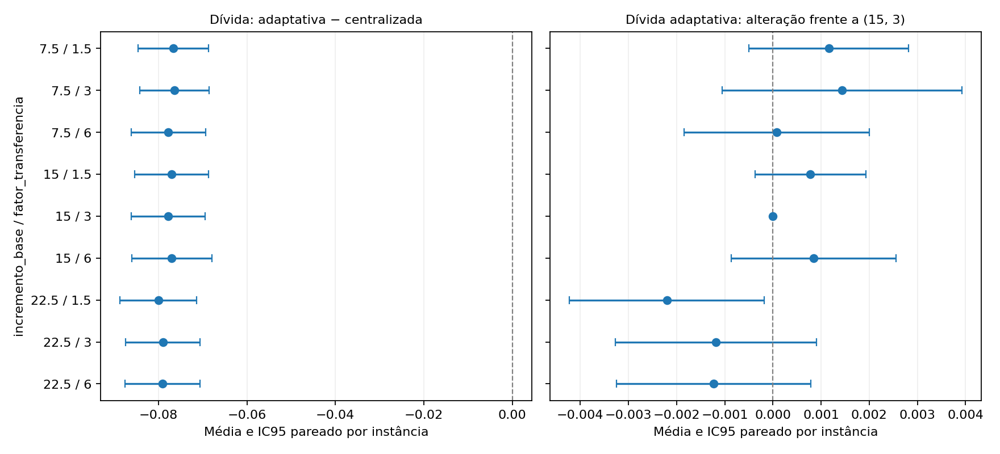

# T-CROWDER.1 — sensibilidade dos escalares de aprendizagem

## Implementação e porta de identidade

`aprendizado.incremento_base=15` e `aprendizado.fator_transferencia=3`
promovidos ao YAML, condição `tcc1` ([TCC1]), equação (4.2). Os três caminhos
leem as mesmas chaves: Simulacao legado, comunicação Crowder do MVP e
comunicação legada do MVP (inclusive contagem TL alternativa). A aritmética,
as conversões de escala e os tetos anteriores foram mantidos. A confusão de
escala legada não foi corrigida nesta mudança: sustenta o controle histórico.

No Crowder, dC=clip((base+fator*(5*C_p−5*C_r))/100,0,0,30); ganho normalizado
dC/5, limitado pela dificuldade da subtarefa. O teto pode amortecer a grade.
O código anterior está preservado no commit dfc0d78. Identidade por float.hex
com essa versão em (15,3): resultados completos, estados de agentes/tarefas,
eventos, registros, reparos e RNG em 24 comparações pelos três caminhos.
23 testes aprovados antes da execução da grade, incluindo identidade neutra.
O teste local reprovou antes da parametrização e passou depois; logs preservados.

## Desenho

Grade 3x3: base=7,5/15/22,5 e fator=1,5/3/6. **22,5 é 1,5x15**, não o dobro;
a lista explícita solicitada prevalece. Sensibilidade sem alvo externo, sem
recalibração ou escolha de valores. Ambos os braços recebem os mesmos escalares.
16 instâncias e 12 sementes, idênticas às 384 execuções nominais arquivadas,
em cada uma das nove combinações. Horizonte nominal 256xCPM.

IC95 t sobre 16 médias por instância de diferenças pareadas por semente.
Intervalos pontuais exploratórios, sem ajuste para multiplicidade. As 12
sementes por instância não são tratadas como 192 instâncias independentes.
Mesmas sementes iniciais, sem alegar alinhamento de eventos após divergência.

**3456 execuções; 3456 completas; 0 violações.**

A censura acompanha todas as tabelas; pares completos são exportados também.
Nenhum valor indefinido é convertido em zero. As nove células não mudam o nominal.

## Cinco indicadores, adaptativa − centralizada

Atraso=makespan/CPM sem recursos (não crescimento externo de prazo); fração P1
conta omissões/(omissões+inícios analíticos). Nenhum desses cinco usa TL no
denominador. Tabela completa de contrastes e IC95:

| incremento_base | fator_transferencia | estatuto | atraso_relativo | divida_latente_sobre_plano | fracao_porta1 | taxa_falha_efetiva | taxa_omissao |
| --- | --- | --- | --- | --- | --- | --- | --- |
| 7.5 | 1.5 | COMPLETO | -0.996299 [-1.081437; -0.911160] | -0.076653 [-0.084644; -0.068661] | -0.086198 [-0.106847; -0.065549] | -0.042448 [-0.054914; -0.029982] | -0.229427 [-0.242298; -0.216557] |
| 7.5 | 3.0 | COMPLETO | -1.003296 [-1.085851; -0.920740] | -0.076383 [-0.084228; -0.068538] | -0.090625 [-0.109868; -0.071382] | -0.043750 [-0.058596; -0.028904] | -0.230035 [-0.243476; -0.216593] |
| 7.5 | 6.0 | COMPLETO | -1.006300 [-1.095972; -0.916627] | -0.077741 [-0.086122; -0.069359] | -0.085677 [-0.103819; -0.067535] | -0.044878 [-0.061216; -0.028541] | -0.228646 [-0.241467; -0.215825] |
| 15.0 | 1.5 | COMPLETO | -1.029833 [-1.117843; -0.941823] | -0.077037 [-0.085357; -0.068717] | -0.109201 [-0.129366; -0.089036] | -0.042014 [-0.054679; -0.029349] | -0.225521 [-0.240126; -0.210916] |
| 15.0 | 3.0 | COMPLETO | -1.023421 [-1.113870; -0.932973] | -0.077815 [-0.086201; -0.069428] | -0.116493 [-0.136605; -0.096381] | -0.043056 [-0.056843; -0.029268] | -0.228212 [-0.242839; -0.213584] |
| 15.0 | 6.0 | COMPLETO | -1.027480 [-1.114247; -0.940713] | -0.076969 [-0.086018; -0.067919] | -0.121267 [-0.144528; -0.098007] | -0.048003 [-0.062805; -0.033202] | -0.232031 [-0.245732; -0.218330] |
| 22.5 | 1.5 | COMPLETO | -1.069827 [-1.155424; -0.984229] | -0.080016 [-0.088689; -0.071344] | -0.145486 [-0.169077; -0.121895] | -0.058854 [-0.069934; -0.047775] | -0.231858 [-0.245076; -0.218639] |
| 22.5 | 3.0 | COMPLETO | -1.074184 [-1.160559; -0.987809] | -0.079003 [-0.087425; -0.070581] | -0.150955 [-0.172889; -0.129021] | -0.056597 [-0.067429; -0.045766] | -0.229253 [-0.241858; -0.216649] |
| 22.5 | 6.0 | COMPLETO | -1.086810 [-1.175781; -0.997839] | -0.079045 [-0.087530; -0.070560] | -0.154774 [-0.174327; -0.135222] | -0.058681 [-0.069082; -0.048279] | -0.231597 [-0.245250; -0.217944] |

[CSV dos contrastes](../outputs/diagnosticos/GOV2_CROWDER1_20260919/CROWDER1_cinco_IC95.csv),
[valores absolutos por braço](../outputs/diagnosticos/GOV2_CROWDER1_20260919/CROWDER1_por_braco_IC95.csv),
[ANTES/DEPOIS e diferenças pareadas frente a (15,3)](../outputs/diagnosticos/GOV2_CROWDER1_20260919/CROWDER1_antes_depois.csv).

## Dívida latente — leitura prioritária

| incremento_base | fator_transferencia | cenario | media | ic95_inf | ic95_sup | estatuto |
| --- | --- | --- | --- | --- | --- | --- |
| 7.5 | 1.5 | adaptativa | 0.026619 | 0.024161 | 0.029078 | COMPLETO |
| 7.5 | 1.5 | centralizada | 0.103272 | 0.09376 | 0.112784 | COMPLETO |
| 7.5 | 3.0 | adaptativa | 0.026889 | 0.02378 | 0.029998 | COMPLETO |
| 7.5 | 3.0 | centralizada | 0.103272 | 0.09376 | 0.112784 | COMPLETO |
| 7.5 | 6.0 | adaptativa | 0.025532 | 0.022851 | 0.028212 | COMPLETO |
| 7.5 | 6.0 | centralizada | 0.103272 | 0.09376 | 0.112784 | COMPLETO |
| 15.0 | 1.5 | adaptativa | 0.026235 | 0.023812 | 0.028658 | COMPLETO |
| 15.0 | 1.5 | centralizada | 0.103272 | 0.09376 | 0.112784 | COMPLETO |
| 15.0 | 3.0 | adaptativa | 0.025458 | 0.022972 | 0.027943 | COMPLETO |
| 15.0 | 3.0 | centralizada | 0.103272 | 0.09376 | 0.112784 | COMPLETO |
| 15.0 | 6.0 | adaptativa | 0.026303 | 0.023999 | 0.028608 | COMPLETO |
| 15.0 | 6.0 | centralizada | 0.103272 | 0.09376 | 0.112784 | COMPLETO |
| 22.5 | 1.5 | adaptativa | 0.023256 | 0.02056 | 0.025952 | COMPLETO |
| 22.5 | 1.5 | centralizada | 0.103272 | 0.09376 | 0.112784 | COMPLETO |
| 22.5 | 3.0 | adaptativa | 0.024269 | 0.021715 | 0.026824 | COMPLETO |
| 22.5 | 3.0 | centralizada | 0.103272 | 0.09376 | 0.112784 | COMPLETO |
| 22.5 | 6.0 | adaptativa | 0.024227 | 0.0219 | 0.026555 | COMPLETO |
| 22.5 | 6.0 | centralizada | 0.103272 | 0.09376 | 0.112784 | COMPLETO |

Alteração da dívida na adaptativa frente ao próprio nominal (15,3), com IC95
pareado; a centralizada permanece inalterada:

| incremento_base | fator_transferencia | antes | depois | media | ic95_inf | ic95_sup | estatuto |
| --- | --- | --- | --- | --- | --- | --- | --- |
| 7.5 | 1.5 | 0.025458 | 0.026619 | 0.001162 | -0.000496 | 0.00282 | COMPLETO |
| 7.5 | 3.0 | 0.025458 | 0.026889 | 0.001432 | -0.001058 | 0.003921 | COMPLETO |
| 7.5 | 6.0 | 0.025458 | 0.025532 | 7.4e-05 | -0.001849 | 0.001997 | COMPLETO |
| 15.0 | 1.5 | 0.025458 | 0.026235 | 0.000777 | -0.000372 | 0.001927 | COMPLETO |
| 15.0 | 3.0 | 0.025458 | 0.025458 | 0.0 | 0.0 | 0.0 | COMPLETO |
| 15.0 | 6.0 | 0.025458 | 0.026303 | 0.000846 | -0.000863 | 0.002555 | COMPLETO |
| 22.5 | 1.5 | 0.025458 | 0.023256 | -0.002202 | -0.004222 | -0.000181 | COMPLETO |
| 22.5 | 3.0 | 0.025458 | 0.024269 | -0.001188 | -0.003277 | 0.0009 | COMPLETO |
| 22.5 | 6.0 | 0.025458 | 0.024227 | -0.00123 | -0.003247 | 0.000786 | COMPLETO |

A dívida é pico normalizado pelo plano, estatística de extremo com horizonte
endógeno. Variações de duração e oportunidades de amostragem podem afetá-la;
esta sensibilidade não remove a restrição do contrato observacional externo.

## Assimetria do canal e teto de dC

| incremento_base | fator_transferencia | cenario | N | completas | N_req_medio | N_success_medio | TL_medio | dC_por_sucesso | fracao_sucessos_teto |
| --- | --- | --- | --- | --- | --- | --- | --- | --- | --- |
| 7.5 | 1.5 | adaptativa | 192 | 192 | 151.723958 | 108.578125 | 108.578125 | 0.080627 | 0.0 |
| 7.5 | 1.5 | centralizada | 192 | 192 | 0.0 | 0.0 | 0.0 | nan | nan |
| 7.5 | 3.0 | adaptativa | 192 | 192 | 151.411458 | 108.635417 | 108.635417 | 0.086105 | 0.0 |
| 7.5 | 3.0 | centralizada | 192 | 192 | 0.0 | 0.0 | 0.0 | nan | nan |
| 7.5 | 6.0 | adaptativa | 192 | 192 | 152.411458 | 108.838542 | 108.838542 | 0.096752 | 0.0 |
| 7.5 | 6.0 | centralizada | 192 | 192 | 0.0 | 0.0 | 0.0 | nan | nan |
| 15.0 | 1.5 | adaptativa | 192 | 192 | 143.536458 | 103.552083 | 103.552083 | 0.156332 | 0.0 |
| 15.0 | 1.5 | centralizada | 192 | 192 | 0.0 | 0.0 | 0.0 | nan | nan |
| 15.0 | 3.0 | adaptativa | 192 | 192 | 141.973958 | 102.859375 | 102.859375 | 0.162627 | 0.0 |
| 15.0 | 3.0 | centralizada | 192 | 192 | 0.0 | 0.0 | 0.0 | nan | nan |
| 15.0 | 6.0 | adaptativa | 192 | 192 | 139.989583 | 100.723958 | 100.723958 | 0.175165 | 0.000207 |
| 15.0 | 6.0 | centralizada | 192 | 192 | 0.0 | 0.0 | 0.0 | nan | nan |
| 22.5 | 1.5 | adaptativa | 192 | 192 | 137.161458 | 98.640625 | 98.640625 | 0.231987 | 0.0 |
| 22.5 | 1.5 | centralizada | 192 | 192 | 0.0 | 0.0 | 0.0 | nan | nan |
| 22.5 | 3.0 | adaptativa | 192 | 192 | 136.682292 | 98.015625 | 98.015625 | 0.239069 | 0.000691 |
| 22.5 | 3.0 | centralizada | 192 | 192 | 0.0 | 0.0 | 0.0 | nan | nan |
| 22.5 | 6.0 | adaptativa | 192 | 192 | 131.557292 | 94.078125 | 94.078125 | 0.252104 | 0.059846 |
| 22.5 | 6.0 | centralizada | 192 | 192 | 0.0 | 0.0 | 0.0 | nan | nan |

Em toda a grade centralizada, N_req=0 e TL=0. Seus resultados são idênticos
bit a bit aos da célula (15,3) nos campos comuns. Assim, qualquer mudança do
contraste nesta grade vem do braço adaptativo. A atividade e a fração de
sucessos no teto acima permitem distinguir escalar nominal de ganho realizado.

## Controles e limites da inferência

As 384 execuções em (15,3) reproduzem todos os campos numéricos comuns do
nominal arquivado por float.hex (CSV lido com round_trip). Os hashes da
implementação/configurações permaneceram constantes durante a grade.
Nenhuma alteração de V_mod ou busca de política/valor ótimo foi feita.
Esta grade caracteriza a sensibilidade nominal; não demonstra que os escalares
causaram as exceções localizadas em T-GOV.2, pois aqueles perfis de governança
não foram reexecutados aqui. Ver [localização e multiplicidade](TGOV2_LOCALIZACAO_INVERSOES_20260919.md).

## Síntese dos sinais na grade declarada

| metrica | N | medias_negativas | IC_negativos | IC_positivos | media_min | media_max |
| --- | --- | --- | --- | --- | --- | --- |
| atraso_relativo | 9 | 9 | 9 | 0 | -1.08681 | -0.996299 |
| divida_latente_sobre_plano | 9 | 9 | 9 | 0 | -0.080016 | -0.076383 |
| fracao_porta1 | 9 | 9 | 9 | 0 | -0.154774 | -0.085677 |
| taxa_falha_efetiva | 9 | 9 | 9 | 0 | -0.058854 | -0.042014 |
| taxa_omissao | 9 | 9 | 9 | 0 | -0.232031 | -0.225521 |

As faixas são descritivas da família declarada, sem ranking ou seleção.

**Leitura:** os cinco indicadores têm média e IC95 inteiramente negativos em
9/9 combinações. Para dívida, o contraste vai de −0,080016 a −0,076383;
a alteração da média adaptativa frente ao nominal vai de −0,002202 a
+0,001432. Apenas (22,5;1,5) exclui zero no IC95 dessa alteração pareada:
−0,002202 [−0,004222;−0,000181], leitura exploratória sem ajuste múltiplo.
Não se elege essa célula. Os escalares afetam magnitude/atividade, mas não
explicam uma inversão nominal de sinal nesta família.

O ganho dC médio por sucesso muda de cerca de 0,081 a 0,252 na escala
original; no canto (22,5;6), 5,98% dos sucessos atingem o teto 0,30. Portanto
a persistência do sinal não decorre de os parâmetros terem ficado inertes
na adaptativa. O nominal (15,3) desta grade usa 16 instâncias; não confundir
seu IC com o nominal de quatro instâncias da grade T-GOV.1.

